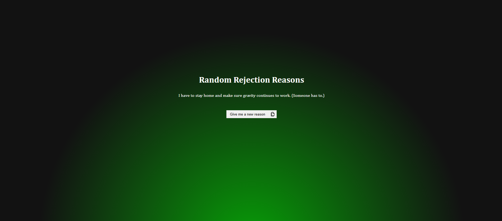

# Random Rejection Reasons

A simple Next.js application that generates random, creative, and sometimes humorous rejection reasons using the No-as-a-Service API.

Built with Next.js (App Router), TypeScript, and React.

---

## Features

- Fetch random rejection reasons from an external API
- Copy rejection reason to clipboard
- Visual feedback on successful copy
- Error handling with user-friendly messages
- Built using the Next.js App Router
- Type-safe API integration with TypeScript

## Preview



---

## Tech Stack

- Next.js (App Router)
- React
- TypeScript
- React Icons
- No-as-a-Service API

API endpoint used:

https://naas.isalman.dev/no

Rate limit: 120 requests per minute per IP

---

## Installation

Clone the repository:

```bash
git clone https://github.com/yourusername/Random-Rejection-Reasons.git
cd Random-Rejection-Reasons
```
